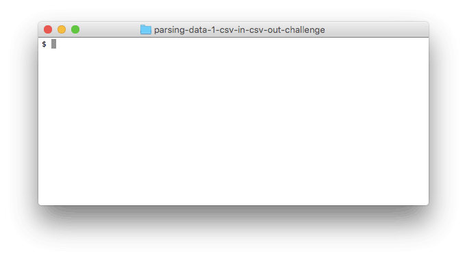

# Парсинг данных: из CSV в JS в CSV

## Введение

Когда мы запускаем наши приложения, создаются объекты JS, которые существуют в памяти нашего компьютера. Эти объекты хранят какую-либо информацию. Состояние «нахождения в памяти» теряется, когда наше приложение заканчивает работу, поэтому, если мы хотим сохранить информацию из приложения, то нам нужно записать его где-нибудь.

В дополнение к сохранению информации из наших программ для себя, мы иногда хотим поделиться этой информацией с другими системами или программами. Для этого, помимо простого сохранения данных, нам нужно сохранить их в формате, который совместим с этими другими системами, и который легко переносится.

Существует общий подход к сохранению информации в различных форматах - это преобразование информации в текст. XML, JSON, CSV и YAML - все это примеры текстовых форматов для обмена данными.

В этой задаче мы будем использовать [CSV][wikipedia csv] в качестве нашего формата для хранения данных. Мы будем представлять людей в JS в качестве экземпляров класса `Person`. Мы будем создавать объекты `Person`  из данных в CSV-файле, а также сохранять состояние объектов JS `Person` в CSV-файле.


## Releases
### Release 0: Представлять людей как объекты JS
Начнем с создания класса `Person`; в нашей программе js каждый экземпляр этого класса будет представлять человека. Наш класс должен быть предназначен для представления данных, найденных в файле `people.csv`. Другими словами, экземпляр класса `Person` должен иметь имя, фамилию и т. д.

Нам нужно будет написать тесты для нашего класса. Какое поведение должно быть у нашего класса `Person`?


### Release 1: Парсинг из CSV в JS

Теперь у нас есть класс, предназначенный для представления человека. Чтобы создать объект `Person`, нам нужно предоставить некоторые данные: имя, фамилию и т.д. Для создания объекта не имеет значения, откуда берутся эти данные. Данные могут предоставляться через пользовательский интерфейс, который может быть на веб-странице. Но в этой задаче данные поступают к нам из файла CSV.

Мы напишем класс `PersonParser`, ответственный за анализ текста в файле и получение объектов `Person` из него. Напишите метод `.parse()`. Этот метод должен преобразовывать каждую строку из csv-файла в объект класса `Person`  и возвращать массив из этих объектов.


### Release 2: соответствующие типы данных в JS
В нашем CSV-файле все представлено в текстовом формате. Это означает, что вся информация из файла приходит в нашу программу в виде строки. Иногда это уместно. Названия, номера телефонов и адреса электронной почты легко представляются в виде строк. В других случаях может оказаться полезным преобразовать текст CSV в объект другого типа.

В `people.csv` дата и время рождения человека сохраняются в поле `bornAt`. В CSV-файле это строка в формате `YYYY-MM-DD HH:MM:SS`. Эта строка представляет дату и время, js в свою очередь предоставляет нам такой класс, как [Date][], специально созданный для представления даты и времени.

Когда мы создаем объекты `Person`  из нашего CSV-файла, убедитесь, что их свойства `bornAt` являются объектами `Date`, а не строками. Также, возможно нам понадобится метод [Date.parse][] или другие методы, связанные с [Date][].


### Release 3: Сохранение информации из js в CSV

>**JavaScript's npm-модули.**
Мы можем воспользоваться библиотекой (npm-модулем, например: `json2csv`) для того, чтобы записать наши js объекты в csv-формате. Этот подход будет проще и, возможно, в некоторых случаях правильнее. Однако вы должны понимать как решить данную задачу и без сторонних npm-модулей. `const json2csv = require('json2csv').parse;`


```js
let jane = new Person(...)
let john = new Person(...)

PersonWriter.write('friends.csv', [jane, john])
```

*Рисунок 1*. Создание людей в js и сохранение данных о них в CSV-файле.

Мы научились парсить данные из CSV в js-объекты, и теперь мы можем использовать их в наших программах. Теперь мы будем работать с объектами js и сохранить данные о них в CSV-файле. Для этого мы создадим класс `PeopleWriter` с методом `.write`. Мы можем создать массив объектов `People`, а затем записать их в файл. (см. Рисунок 1)

-----
## Опционально

### Release 4: Работа с объектами JS (Опционально)


*Рисунок 1*. Фильтрация объектов js, созданных из файла CSV.

Одним из преимуществ загрузки данных из файла CSV в объекты js является то, что нам становится проще «фильтровать» коллекцию людей или манипулировать их атрибутами. Например, мы могли бы отсортировать людей по имени. Или мы можем обновить номер телефона человека.

Мы хотим, чтобы наша программа позволяла пользователям «фильтровать» людей, используя разные команды: фильтрацию людей по определенному региональному коду, по определенной фамилии, адресу электронной почты из определенного домена или родившихся после определенного года. Когда мы закончим эту процедуру, программа должна работать аналогично примеру на Рисунке 1.

Начните с разработки функции поиска людей по коду региона. Запустите программу и следуйте сообщениям об ошибках. После того, как пользователи смогут искать людей по региональному коду, выполните три другие функции: поиск по фамилии, по электронной почте и по году рождения. Затем придумайте и добавьте еще один параметр для поиска.


### Release 5: Сбор и сохранение информации (Опционально)
Теперь, когда мы можем записать данные в CSV, давайте напишем скрипт, который позволит нам создать адресную книгу CSV на основе пользовательского ввода. Мы вводим имена людей, номера телефонов и т.д., а затем сохраняем данные в файл CSV. Давайте напишем такой файл `runner.js`, чтобы при его запуске нам предлагалось ввести информацию. Мы вводим данные как можно большего количества людей. И затем, как только мы закончим делать записи, данные, которые мы ввели, будут записаны в файл CSV.


## Заключение
Общая цель этой задачи - научиться манипулировать объектами js и CSV как частью одного приложения. Все данные, которые нам нужны для представления людей, были сохранены в CSV-файле, но CSV-файл был просто текстовым и, соответственно, был лишен индивидуального поведения (например, возврат имени). Создав объекты js на основе данных, мы смогли создать объекты, поведение которых соответствовало потребностям нашего приложения. Это общая схема разработки программного обеспечения: нужно изменить представление данных из формата A в формат B, чтобы упростить работу с X.

[Date]: https://developer.mozilla.org/ru/docs/Web/JavaScript/Reference/Global_Objects/Date
[Date.parse()]: https://developer.mozilla.org/ru/docs/Web/JavaScript/Reference/Global_Objects/Date/parse
[wikipedia csv]: https://en.wikipedia.org/wiki/Comma-separated_values
[wikipedia lazy initialization]: https://en.wikipedia.org/wiki/Lazy_initialization
[wikipedia memoization]: https://en.wikipedia.org/wiki/Memoization
